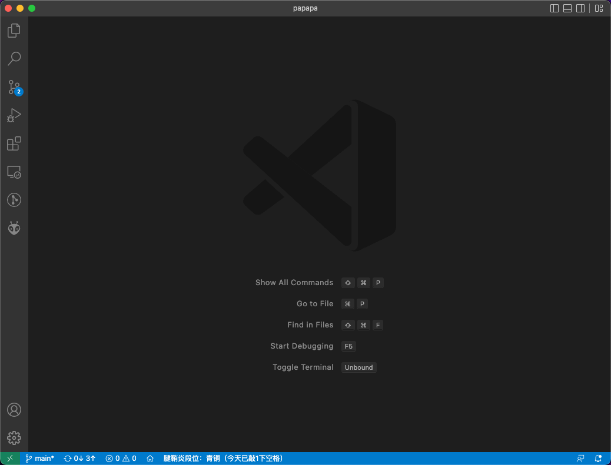
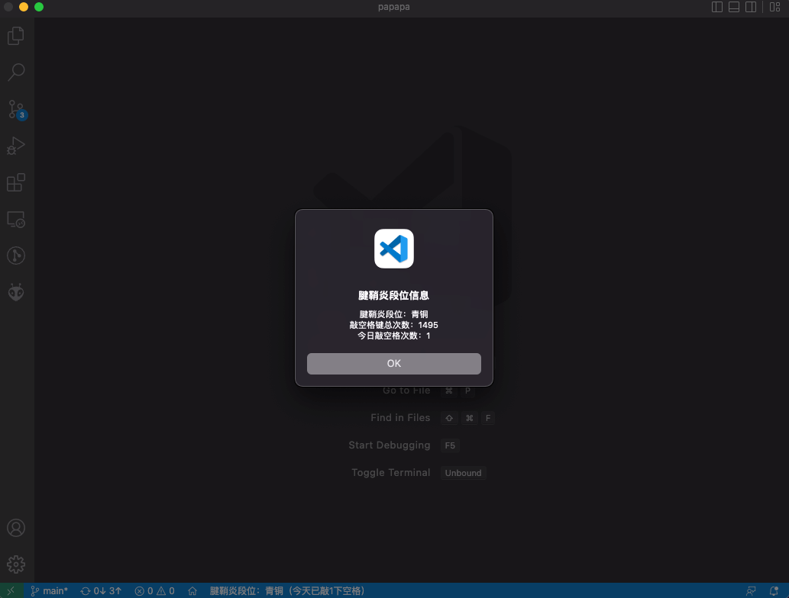

# 腱鞘炎等级统计器，又名空格计数器

一个用于统计按空格键次数的插件。

## 前言

 在一个炎热又无聊的周末，在家玩了两天手机，晚上突然发现右手的大拇指根部酸疼，于是贴了个狗皮膏药以为第二天就能好了。结果第二天还是酸疼酸疼的，于是百度了一下，结果发现好像是腱鞘炎，反思了一下估计是代码敲太多了，而大拇指敲的空格键最多，于是有了开发一个空格统计器的想法。因为敲空格键的声音是 `啪啪啪`，所以本插件名叫 `papapa` 。

## 用法

* 安装之后即可自动运行，会在 vscode 的底部显示今日按空格次数及腱鞘炎段位信息。
* 空格键敲的次数越多，腱鞘炎段位越高。
* 点击底部状态栏可查看你的段位信息。

## 等级

| 次数            | 等级名称 |
| --------------- | -------- |
| 0 - 99999       | 青铜     |
| 100000 - 199999 | 白银     |
| 200000 - 299999 | 黄金     |
| 300000 - 399999 | 铂金     |
| 400000 - 499999 | 钻石     |
| 500000 - 599999 | 大神     |
| 600000 - 699999 | 无敌     |
| >= 700000       | 传说     |

## 预览

## 源码

https://github.com/LevineHua/vscode-papapa

